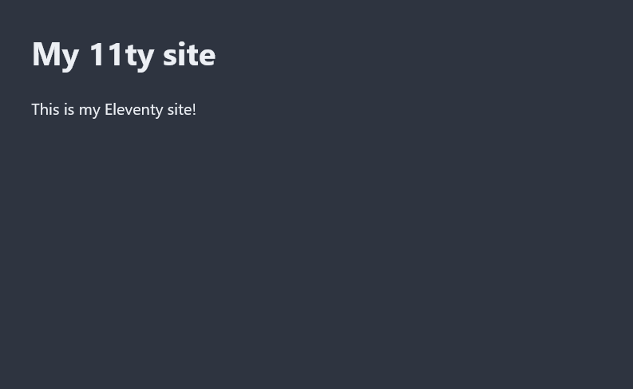

## Styles

> [!NOTE]
> The final version of the site for this section can be viewed [here](https://github.com/nathonius/11ty-demo/tree/main/3-styles).

Our site is functional, but a bit ugly. Let's add some styles! For this demo project, I'm going to use a pre-built minimal and classless CSS framework called [Bamboo](https://github.com/rilwis/bamboo). You can use whatever you'd like, from rolling your own css to start with, all the way to integrating Tailwind CSS or another css framework. I've downloaded `bamboo.min.css` to a new folder, `src/css`.

```shell
mkdir src/css
curl -o src/css/bamboo.min.css https://raw.githubusercontent.com/rilwis/bamboo/master/dist/bamboo.min.css
```

There are multiple options for adding CSS to our site. The most straightforward way to add a single CSS file is to use Eleventy's [passthrough copy](https://www.11ty.dev/docs/copy/) function:

```js
// .eleventy.js
export default function (config) {
  config.addPassthroughCopy({ "src/css/bamboo.min.css": "bamboo.min.css" });
  return {
    markdownTemplateEngine: "njk",
    htmlTemplateEngine: "njk",
    dir: {
      input: "src",
      output: "public",
    },
  };
}
```

This will simply copy `bamboo.min.css` to the `public` directory. Now we can link it in our base template:


```html
<!-- base.njk -->
  <head>
    <meta charset="UTF-8" />
    <meta name="viewport" content="width=device-width, initial-scale=1.0" />
    <link rel="stylesheet" href="bamboo.min.css" />
    <title>My Project - {{ title }}</title>
  </head>
```


Now the css file will be included and we even have an automatic dark and light mode. Thanks Bamboo!


